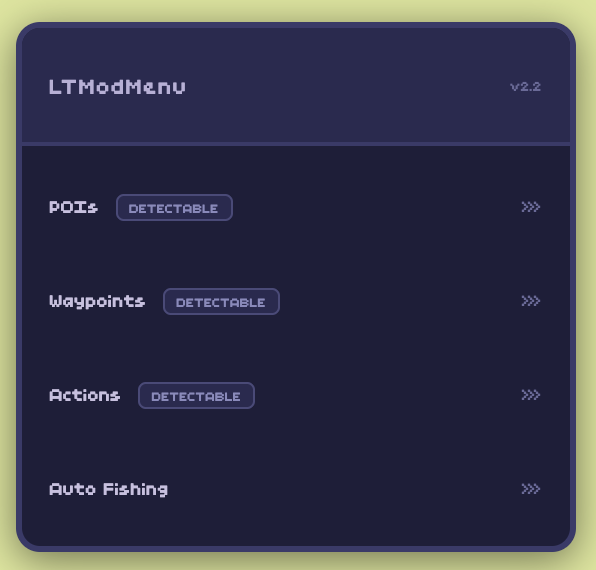

# LTModMenu

**Mod menu for [Lofi Town](https://lofi.town/)**

[![Release][release-badge]][release-url]
[![Stars][stars-badge]][stars-url]
[![Tampermonkey][tm-badge]][install-url]
[![TypeScript][ts-badge]](#)

[Install](#installation) · [Features](#features) · [Report Bug][issues-url]

> **Use at your own risk.** This mod menu may violate Lofi Town's terms of service and could result in your account being banned.

Table of Contents

- [Installation](#installation)
- [Features](#features)
- [Keyboard Shortcuts](#keyboard-shortcuts)
- [Built With](#built-with)
- [Contributors](#contributors)

## Installation

 

1. Install [Tampermonkey](https://www.tampermonkey.net/) on your browser (Chrome, Firefox, Edge, Safari, Opera)
2. Click the button above — Tampermonkey will prompt you automatically
3. Go to [lofi.town](https://lofi.town/) — the menu appears on screen

Updates are delivered automatically via Tampermonkey.

## Features

### 🎣 Fishing

<table>
<tr>
<td width="50%">

**Auto Fishing Bot**

Fully automated 5-phase state machine: cast, reel, challenge resolution (FNV-1a solver), result collection, and loop. Humanized delays, smart timeouts, fail blocking, force fishing mode.

</td>
<td width="50%">

**Statistics & Database**

Real-time tracking with auto-save: total caught, gold earned, rarity breakdown, shiny detection (x50 gold). 54 fish species across 7 rarities — Common, Uncommon, Rare, Epic, Legendary, Secret, Event.

</td>
</tr>
</table>

### 🗺️ Teleportation

<table>
<tr>
<td width="50%">

**POIs & Waypoints**

Fixed points of interest and custom waypoints — save your current position, teleport in one click, delete individually.

</td>
<td width="50%">

**Cross-Map Navigation**

Lobby switching with transition overlay, burrow visits with privacy check, inter-map player tracking.

</td>
</tr>
</table>

### 👥 Players

<table>
<tr>
<td width="50%">

**Player Browser**

Live player list with search by display name or username. Full grid browser with auto-refresh. Friends tracking with real-time status.

</td>
<td width="50%">

**Teleport to Players**

Jump to any player on the current map. Cross-lobby navigation to friends on other maps. Burrow visits for accessible players.

</td>
</tr>
</table>

### ⚡ Actions

| Action          | Description                                                          |
| --------------- | -------------------------------------------------------------------- |
| **Sit / Stand** | Toggle sitting animation                                             |
| **Noclip**      | Bypass all collision detection                                       |
| **Speed**       | Multiplier from 1x to 10x, persisted across sessions and map changes |

## Keyboard Shortcuts

| Key          | Action            |
| ------------ | ----------------- |
| <kbd>1</kbd> | Toggle menu       |
| <kbd>2</kbd> | Previous item     |
| <kbd>3</kbd> | Next item         |
| <kbd>4</kbd> | Select / activate |
| <kbd>5</kbd> | Back              |

> Disabled when a text input is focused.

## Built With

[![TypeScript][ts-stack-badge]](#)
[![Webpack][webpack-badge]](#)
[![Tampermonkey][tm-stack-badge]](#)

## Contributors

<!-- Reference-style links -->

[release-badge]: https://img.shields.io/github/v/release/mdorizon/LTModMenu?style=flat-square&color=blue
[release-url]: https://github.com/mdorizon/LTModMenu/releases/latest
[stars-badge]: https://img.shields.io/github/stars/mdorizon/LTModMenu?style=flat-square
[stars-url]: https://github.com/mdorizon/LTModMenu/stargazers
[tm-badge]: https://img.shields.io/badge/Tampermonkey-userscript-00485b?style=flat-square&logo=tampermonkey&logoColor=white
[ts-badge]: https://img.shields.io/badge/TypeScript-strict-3178c6?style=flat-square&logo=typescript&logoColor=white
[install-url]: https://mdorizon.github.io/LTModMenu/ltmodmenu.user.js
[issues-url]: https://github.com/mdorizon/LTModMenu/issues
[ts-stack-badge]: https://img.shields.io/badge/TypeScript-3178c6?style=for-the-badge&logo=typescript&logoColor=white
[webpack-badge]: https://img.shields.io/badge/Webpack-8DD6F9?style=for-the-badge&logo=webpack&logoColor=black
[tm-stack-badge]: https://img.shields.io/badge/Tampermonkey-00485b?style=for-the-badge&logo=tampermonkey&logoColor=white
